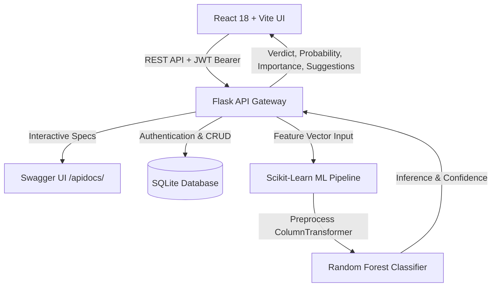

# PlacementAI Pro — Smart Campus Placement Prediction System

[](#machine-learning-pipeline)
[](https://flask.palletsprojects.com/)
[](https://vitejs.dev/)
[](#interactive-swagger-documentation)
[](#multi-theme-support)

An end-to-end, production-grade placement prediction and career intelligence platform designed for engineering and management students. Powered by a trained **Random Forest Machine Learning Pipeline**, the system evaluates academic performance, practical experience, technical skills, and communication to deliver instant placement probabilities, explainable AI impact factors, and personalized improvement roadmaps.

---

## Architecture Overview



---

## Tech Stack

| Layer | Technologies |
| :--- | :--- |
| **Frontend** | React 18, Vite, React Router 6, Axios, Chart.js, React-Chartjs-2, Vanilla CSS Design System |
| **Backend** | Python 3, Flask, Flask-CORS, PyJWT, Werkzeug Security, Flasgger (OpenAPI 2.0 / Swagger UI) |
| **Machine Learning** | Scikit-Learn (Random Forest, ColumnTransformer, OneHotEncoder, Imputer), Pandas, NumPy, Joblib |
| **Database** | SQLite3 (with indexed user and prediction history tables) |

---

## Key Features

1. **Precision Placement Predictions**:
   - Evaluates 12 academic, practical, and skill metrics.
   - Provides confidence rating (`High`, `Medium`, `Low`) and placement probability percentage.
2. **Explainable AI (XAI)**:
   - Dynamic feature weight calculations showing exactly which areas (CGPA, Skills, Internships, Backlogs) influenced the verdict.
3. **Interactive What-If Scenario Simulator**:
   - Real-time sliders allowing students to simulate how gaining internships, clearing backlogs, or raising CGPA alters placement odds.
4. **Historical Trend Tracking & Side-by-Side Comparison**:
   - SQLite database logging every attempt per user.
   - Progress delta calculations (`+` or `-` probability vs prior attempts).
   - Side-by-side comparison modal to contrast any two test runs.
5. **Multi-Factor Career Analytics**:
   - Interactive charts: Placement Probability Progression (Line), Factor Balance vs Benchmarks (Radar), Metric Comparison vs Placed Average (Bar), and Outcome Ratio (Doughnut).
6. **Multi-Theme System (5 Themes)**:
   - 🌙 **Midnight Slate** (Default dark futuristic)
   - ☀️ **Crystal Light** (Clean crisp workspace)
   - ⚡ **Cyber Neon** (High-contrast synthwave cyberpunk)
   - 🌿 **Forest Emerald** (Luxurious green & mint)
   - 🌆 **Sunset Indigo** (Warm royal indigo)
7. **Comprehensive User & Data Management**:
   - JWT authentication with secure password hashing.
   - Profile updating and theme synchronization.
   - 1-Click export to **CSV** and **JSON**.
   - 1-Click demo login for instant testing.

---

## Project Structure

```text
placement-prediction-system/
├── backend/
│   ├── app.py                   # Flask API entrypoint & Swagger documentation
│   ├── auth.py                  # JWT authentication & password security
│   ├── database.py              # SQLite database schema, indexing & CRUD
│   ├── generate_dataset.py      # Synthetic dataset generation utility
│   ├── model.py                 # Scikit-Learn training pipeline & evaluation
│   ├── model.pkl                # Serialized trained model pipeline
│   ├── accuracy.txt             # Model accuracy summary
│   ├── dataset.csv              # 2,000-record training dataset
│   ├── requirements.txt         # Backend Python dependencies
│   └── test_backend.py          # 13-step backend integration test suite
├── data/
│   ├── dataset.csv              # Ground truth dataset
│   ├── train_cleaned.csv        # 80% training partition
│   └── test_cleaned.csv         # 20% validation partition
├── frontend/
│   ├── index.html               # Entry HTML with Google Fonts & SEO tags
│   ├── package.json             # NPM dependencies & scripts
│   ├── vite.config.js           # Vite development server configuration
│   ├── src/
│   │   ├── main.jsx             # React DOM root & Router
│   │   ├── App.jsx              # Main application router
│   │   ├── index.css            # Complete design system & 5-theme tokens
│   │   ├── components/
│   │   │   ├── Navbar.jsx           # Responsive header & user profile avatar
│   │   │   ├── PredictionForm.jsx   # Input form with quick-fill presets
│   │   │   ├── PredictionResult.jsx # Circular score gauge, XAI & report print
│   │   │   └── WhatIfSimulator.jsx  # Live reactive sliders & delta output
│   │   ├── context/
│   │   │   ├── AuthContext.jsx      # Global authentication state
│   │   │   └── ThemeContext.jsx     # 5-theme theme state manager
│   │   ├── pages/
│   │   │   ├── Home.jsx             # Landing page & feature showcase
│   │   │   ├── Predict.jsx          # Prediction studio & history prefill
│   │   │   ├── Dashboard.jsx        # KPI summary & career readiness matrix
│   │   │   ├── History.jsx          # Search, filters & comparison modal
│   │   │   ├── Analytics.jsx        # Chart.js visualization dashboard
│   │   │   ├── Settings.jsx         # Profile, theme, password & data export
│   │   │   ├── Login.jsx            # Sign In with 1-click demo login
│   │   │   └── Register.jsx         # User registration with theme picker
│   │   └── services/
│   │       └── api.js               # Centralized Axios service with JWT interceptor
├── .gitignore
├── .env.example
└── README.md
```

---

## Quick Start Guide

### 1. Backend Setup

```bash
cd backend

# 1. Install dependencies
pip install -r requirements.txt

# 2. (Optional) Re-generate dataset and train model
python generate_dataset.py
python model.py

# 3. Run integration tests
python test_backend.py

# 4. Start the Flask server
python app.py
```

- **Backend API**: `http://localhost:5000`
- **Interactive Swagger Docs**: `http://localhost:5000/apidocs/` (or `http://localhost:5000/docs`)

---

### 2. Frontend Setup

Open a second terminal window:

```bash
cd frontend

# 1. Install dependencies
npm install

# 2. Start the Vite development server
npm run dev
```

- **Frontend Application**: `http://localhost:5173`

---

## Demo Credentials

For quick evaluation without manual registration, use the pre-seeded account:
- **Username / Email**: `demouser` or `demouser@example.com`
- **Password**: `password123`
- Or simply click **⚡ 1-Click Demo Login** on the Sign In page.

---

## API Specification

| Method | Endpoint | Auth | Description |
| :--- | :--- | :---: | :--- |
| `GET` | `/` | No | API status, version, and documentation link |
| `GET` | `/api/health` | No | Backend health check and model loading status |
| `GET` | `/api/accuracy` | No | Returns the trained model accuracy percentage |
| `POST` | `/api/auth/register` | No | Register a new user account |
| `POST` | `/api/auth/login` | No | Log in and receive a signed JWT token |
| `GET` | `/api/auth/me` | Bearer | Get the current authenticated user profile |
| `PUT` | `/api/auth/profile` | Bearer | Update user profile, target role, and theme preference |
| `POST` | `/api/auth/change-password` | Bearer | Change current user password |
| `POST` | `/api/predict` | Optional | Run placement prediction with Explainable AI |
| `GET` | `/api/predictions` | Bearer | Fetch user's historical prediction logs |
| `GET` | `/api/predictions/stats` | Bearer | Retrieve aggregate statistics and improvement deltas |
| `DELETE` | `/api/predictions/<id>` | Bearer | Delete a specific prediction record |
| `DELETE` | `/api/predictions/clear-all` | Bearer | Wipe all prediction records for the user |

---

## Machine Learning Pipeline

1. **Feature Engineering**:
   - Multi-skill parsing transforms semicolon-separated strings (e.g., `Python:Advanced; Java:Intermediate; SQL:Beginner`) into normalized skill scores (0–100%).
   - Missing values are imputed using median (numerical) and mode (categorical).
   - Categorical branches (`CSE`, `IT`, `ECE`, `EEE`, `MECH`, `CIVIL`) are one-hot encoded.
2. **Model Architecture**:
   - `RandomForestClassifier` with balanced class weighting, 250 estimators, and max depth constraints to prevent overfitting.
3. **Validation & Metrics**:
   - 5-Fold Stratified Cross-Validation: **~89.25%**
   - Held-out Test Accuracy: **~91.0%**
   - Precision: **~91.4%** | Recall: **~97.4%** | F1-Score: **~94.3%**

---

## License

This project is licensed under the MIT License.
